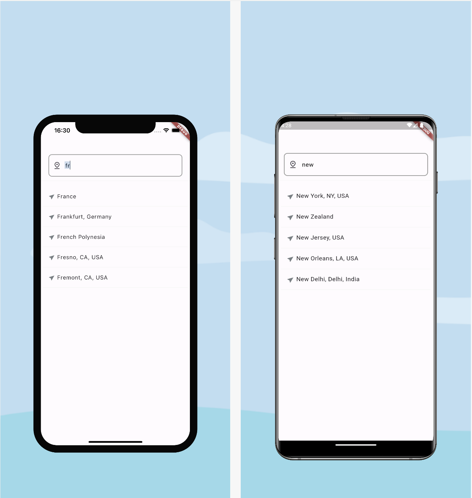

<!--
This README describes the package. If you publish this package to pub.dev,
this README's contents appear on the landing page for your package.

For information about how to write a good package README, see the guide for
[writing package pages](https://dart.dev/guides/libraries/writing-package-pages).

For general information about developing packages, see the Dart guide for
[creating packages](https://dart.dev/guides/libraries/create-library-packages)
and the Flutter guide for
[developing packages and plugins](https://flutter.dev/developing-packages).
-->

## Google Place Autocomplete

GooglePlaceAutocomplete is a Flutter package that integrates with the Google Places API to offer location autocomplete functionality within your Flutter applications. This package allows users to search for places and view autocomplete suggestions in real time as they type.

## Created by [@badiniibrahim](https://github.com/badiniibrahim)

Liked some of my work? Buy me a coffee. Thanks for your support :heart:

<a href="https://buymeacoffee.com/toncopilote" target="_blank"></a>

## Screenshot



## Features

- API Key: This package requires a Google Maps API key (googleMapApiKey) to access the Google Places API for fetching place suggestions.

- Language Support: The language parameter allows you to specify the language for autocomplete suggestions (e.g., 'en' for English, 'fr' for French). It defaults to 'fr' for French but can be customized according to your needs.

- Prediction Callback: The onPredictionSelected callback function is invoked when a user selects a place from the autocomplete suggestions. This enables you to handle the selected prediction in your application.

- Customizable Loading Text: The loadingText parameter lets you specify the text shown while loading suggestions. It defaults to "Loading..." but can be customized to any string.

## Getting started

Add the dependency to your `pubspec.yaml` file:

```yaml
dependencies:
  ...
    google_place_autocomplete: latest_version
```

## Here's a complete example showcasing the usage of the AdaptiveBottomNavigation widget:

```dart
void main() {
  runApp(MyApp());
}

class MyApp extends StatelessWidget {
  @override
  Widget build(BuildContext context) {
    return GetMaterialApp(
      home: HomeScreen(),
    );
  }
}

class HomeScreen extends StatelessWidget {
  @override
  Widget build(BuildContext context) {
    return GooglePlaceAutocomplete(
          googleMapApiKey: 'YOUR_API_KEY',
          onPredictionSelected: (prediction) {
          print('Selected location: ${prediction.description}');
        },
        language: 'en', // Optional: Specify the language for suggestions
        loadingText: 'Please wait...', // Optional: Custom loading text
      )
  }
}


```

### Parameters

- **`googleMapApiKey`**:(required): The Google Maps API key used to retrieve place suggestions.
- **`language`**: (optional): Language code for the suggestions (e.g., 'en' for English, 'fr' for French). Defaults to 'fr'.
- **`onPredictionSelected`**: (required): A function that is called when a prediction is selected from the list of suggestions.
- **`loadingText`**:(optional): The text displayed while loading the suggestions. Defaults to "Loading...".

## LinkedIn

Connect with me on [LinkedIn](https://www.linkedin.com/in/badini-ibrahim-sawadogo-306b119b/)
